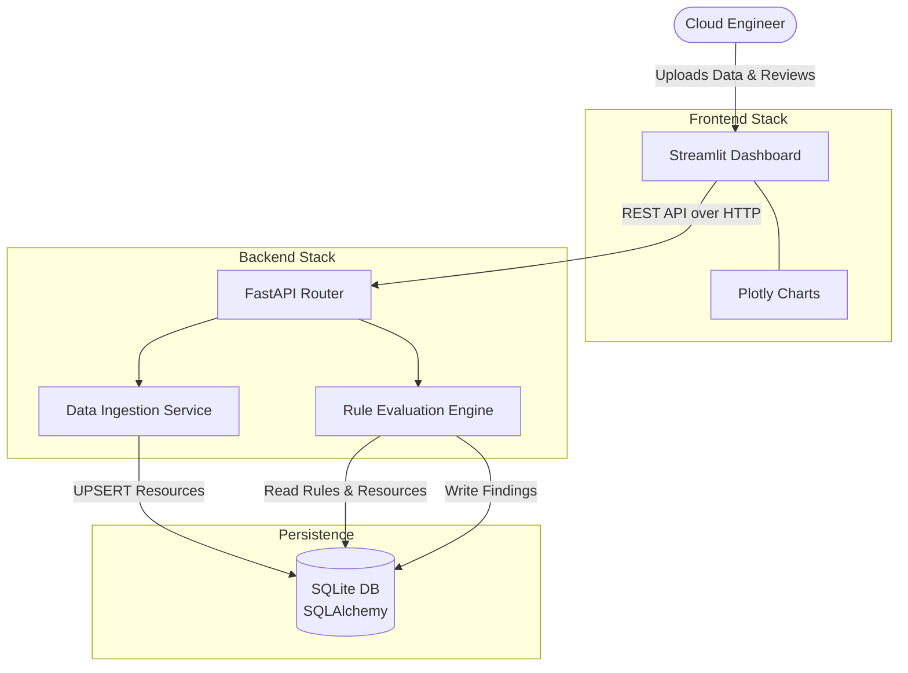
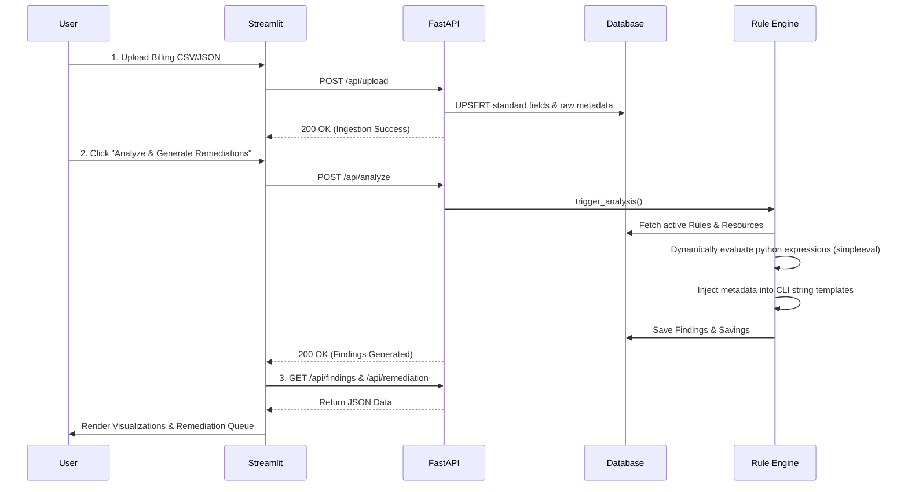

# ☁️ Cloud Cost Optimizer & Remediation Engine

A production-ready FinOps platform built with Python, FastAPI, and Streamlit. It ingests cloud billing data, evaluates resources against a dynamic metadata-driven rule engine, and generates exact CLI commands for automated remediation.

---

## 🏛️ System Architecture



**Detailed Architecture Breakdown:**
The system is built on a decoupled, three-tier architecture ensuring scalability, maintainability, and clear separation of concerns.

1. **Frontend Stack (Presentation Layer)**:
   - **Streamlit Dashboard**: Acts as the primary user interface for Cloud Engineers. It is a lightweight, Python-based web app that allows users to interact with the underlying API seamlessly. It handles file uploads and provides intuitive controls to trigger data analysis and remediation workflows.
   - **Plotly Charts**: Integrated within Streamlit to provide dynamic, interactive data visualizations. This is used to render cost breakdowns and potential savings charts, making it easy for users to comprehend optimization opportunities at a glance.

2. **Backend Stack (Application Layer)**:
   - **FastAPI Router**: Serves as the high-performance entry point for all backend operations. It exposes robust RESTful HTTP endpoints that the frontend communicates with, routing requests to the appropriate underlying services.
   - **Data Ingestion Service**: Triggered by the API router when new billing data is uploaded. It is responsible for parsing, validating, and structuring raw data from multiple cloud providers (AWS, Azure, GCP) into a standardized format before upserting it into the database.
   - **Rule Evaluation Engine**: The core processing brain of the platform. When an analysis is requested, it retrieves cloud resources and evaluates them against defined rules. It safely executes dynamic Python expressions against resource metadata, identifies cost inefficiencies, and uses templating to generate exact, actionable CLI remediation commands.

3. **Persistence Layer (Data Tier)**:
   - **SQLite Database**: A lightweight, file-based relational database currently used for simplified local development and demonstration purposes.
   - **SQLAlchemy ORM**: Acts as an abstraction layer over the SQL database. It defines the schema via Python models and executes queries. This ensures the application is database-agnostic and can seamlessly migrate to production-grade relational databases like PostgreSQL in a cloud deployment.


---

## 🔄 Data & Execution Flow



**Execution Flow Details:**
1. **Data Ingestion**: The user uploads cloud billing data (CSV/JSON) via the Streamlit UI. The FastAPI backend receives this and upserts the resources and metadata into the database.
2. **Rule Evaluation**: The user triggers the analysis. The backend invokes the Rule Engine, which fetches active rules and resources from the database. It dynamically evaluates Python expressions using `simpleeval` to find inefficiencies, templates exact CLI remediation commands, and saves the findings back to the database.
3. **Presentation**: The Streamlit UI retrieves the generated findings from the API to render interactive charts and an actionable remediation queue.


---

## 🚀 Steps to Use the Application

1. **Boot the Platform**: Open your terminal and run `docker-compose up --build`.
2. **Access the Dashboard**: Open your browser and navigate to `http://localhost:8501`.
3. **Verify Seeded Data**: On startup, the database is automatically seeded with 4 core rules for AWS and Azure. You can view these in the **Rule Catalog** tab.
4. **Upload Billing Data**:
   - Go to the **Ingest Billing Data** tab.
   - Upload the sample file: `sample-data/aws_billing.csv`.
   - Ensure the provider is set to `AWS` and click **Upload**.
5. **Analyze the Data**:
   - Click the large **🚀 Analyze & Generate Remediations** button.
   - The engine will evaluate the data against the rules and the page will automatically refresh.
6. **Review Findings**:
   - Navigate to the **Optimization Insights** tab to see your potential cost savings broken down by provider.
   - Go to the **Remediation Queue** tab to view the generated CLI commands (e.g., `aws ec2 delete-volume --volume-id vol-abcde`) that you can copy and run to save money.

---

## 🛠️ Important Commands

### Application Execution
Start the application (builds images and attaches to logs):
```bash
docker-compose up --build
```

Run the application in the background (detached):
```bash
docker-compose up -d
```

Stop the application and remove containers:
```bash
docker-compose down
```

### Testing & Validation
The system features a robust test suite covering >90% of the codebase. Run tests using the dedicated `test` container profile:

Run the entire test suite and generate a coverage report:
```bash
docker-compose run --rm test
```

*Note: This spins up a temporary container that mounts your local workspace, runs `pytest`, and immediately shuts down.*

### Advanced Troubleshooting
If you need to access the database directly, you can SSH into the backend container:
```bash
docker-compose exec backend bash
# Inside the container:
sqlite3 cloud_cost_optimizer.db
```

View API documentation and test endpoints interactively (Swagger UI):
Navigate to `http://localhost:8000/docs` while the platform is running.

---

## ☁️ Cloud Deployment

Because this application is built with a decoupled API and Frontend and is fully containerized, it is cloud-native and highly portable. 

Here are the recommended strategies for deploying this to the cloud:

### 1. Managed Container Services (Recommended)
The easiest way to deploy this multi-container architecture is using Serverless Container services like **AWS Fargate (ECS)**, **Google Cloud Run**, or **Azure Container Apps**.

- **Backend**: Push `Dockerfile.backend` to your container registry (ECR/GCR). Expose it internally on port `8000`.
- **Frontend**: Push `Dockerfile.frontend` to your registry. Configure its environment variable (`API_URL`) to point to the internal backend service URL, and expose it publicly on port `80` or `443`.

### 2. Docker Compose on Virtual Machines (IaaS)
For a simple, low-cost deployment, you can run the exact same `docker-compose.yml` file on a cloud VM (AWS EC2, Azure VM, GCP Compute Engine).
1. Provision a Linux VM.
2. Install Docker and Docker Compose.
3. Clone this repository to the VM.
4. Run `docker-compose up -d --build`.
*(Note: You will want to map port 80 to 8501 using a reverse proxy like NGINX for production traffic).*

### 3. Kubernetes (EKS / GKE / AKS)
For enterprise scale, the containers can be deployed to a Kubernetes cluster using standard deployment manifests.
- Create a `Deployment` and `Service` for the FastAPI backend.
- Create a `Deployment` and `LoadBalancer Service` (or Ingress) for the Streamlit frontend.
- Utilize a persistent volume (PVC) for the SQLite database, or (recommended) migrate the SQLAlchemy connection string from SQLite to a managed database like Amazon RDS (PostgreSQL).
